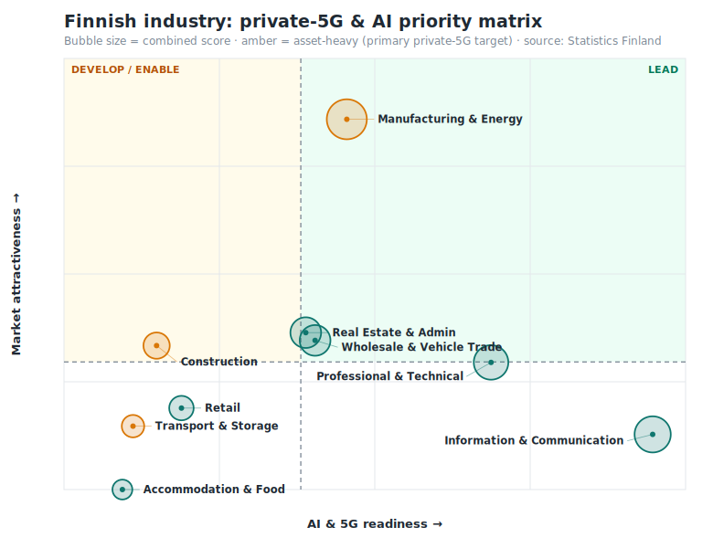
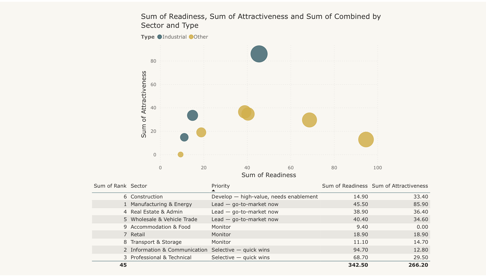

# Finnish Industry 5G & AI Readiness Index 🇫🇮📡

A consulting-style **market-intelligence** pipeline that answers the question a
telecom operator's enterprise arm actually cares about: **which Finnish industry
sectors should be prioritised for industrial 5G and AI-powered automation, and why.**

Real Finnish open data → SQL star schema → scoring model → Power BI report → an
AI-generated executive brief. Built to mirror a real strategy-trainee deliverable:
market-attractiveness assessment → segment prioritisation → recommendation.



Delivered as an interactive **Power BI** report (Power BI Service) — priority-matrix scatter,
ranked shortlist, and a top-target KPI card; DAX and model in [`powerbi/`](powerbi/):



## The question & the answer

Every Finnish enterprise sector is scored on two composites (0–100):

- **Market attractiveness** — turnover, personnel, number of enterprises *(how big the prize is)*
- **AI & 5G readiness** — adoption of AI, autonomous robots/vehicles, IoT sensors, RPA,
  machine learning, cloud, and high-speed connectivity *(how ready they are to buy)*

…and placed on a 2×2 priority matrix. Headline finding: **Manufacturing & Energy
is the clear lead market** — the largest economic prize *and* the highest current
industrial-AI adoption. Asset-heavy **Transport & Storage** and **Construction**
show strong 5G use-case fit but low current digital maturity — *develop-and-enable*
opportunities rather than walk-aways. (Full brief: [`data/executive_brief.md`](data/executive_brief.md).)

## Architecture

```
Statistics Finland StatFin API ──┐
  14yc  Use of IT in enterprises  ├─> ingest.py ─> data/raw/*.json ─> transform.py ─┬─> industry.db (SQLite star schema)
  13vy  Enterprises by industry  ─┘   (json-stat2)                                   ├─> data/powerbi/*.csv ─> Power BI report
                                                                                     ├─> data/scores.json ─> ai_summary.py ─> executive_brief.md
                                                                                     └─> make_chart.py ─> assets/priority-matrix.svg
```

- **Data:** [Statistics Finland](https://pxdata.stat.fi/) open tables **14yc**
  (AI/robotics/IoT/cloud adoption by industry) and **13vy** (turnover, personnel,
  enterprise counts by industry). CC BY 4.0, no API key.
- **Model:** star schema — `fact_metric` + `dim_sector` + `dim_metric` + `sector_score`,
  built with plain Python + SQLite, exported as CSV for Power BI.
- **Scoring:** min-max normalisation per metric across the 9 sectors → documented
  weighted composites → 2×2 quadrant split at each composite's cross-sector average.
  Weights are an **explicit analyst framework** (in `scripts/config.py`), not an
  official figure — they are there to be argued with.
- **Report:** 4-page Power BI report (recommendation matrix, readiness drivers,
  sector profile, executive brief). Model + DAX in [`powerbi/MODEL.md`](powerbi/MODEL.md).
- **AI layer:** `ai_summary.py` turns the scores into a senior-leadership brief —
  the "dashboard that explains itself" pattern.

## Run it

```bash
python3 scripts/ingest.py      # pull the two StatFin tables (no key needed)
python3 scripts/transform.py   # build star schema + scoring + CSVs
python3 scripts/make_chart.py  # render the priority-matrix SVG
OPENAI_API_KEY=xxx python3 scripts/ai_summary.py   # exec brief (falls back to a structured brief without a key)
```

No dependencies outside the Python 3.9+ standard library.

## What this demonstrates

- Consulting-style market intelligence: multi-source data → attractiveness/readiness
  assessment → **segment prioritisation** → defensible recommendation.
- Dimensional modelling (star schema, surrogate keys) and Power BI / DAX.
- Working with real government open data via API (StatFin PxWeb, json-stat2).
- Combining an LLM with structured data for automated executive reporting.
- Honest analysis: transparent, documented scoring weights and an explicit
  data-vintage note; judgement calls labelled as such.

> Built by Anna Sebedach as a portfolio project. Scoring weights are illustrative
> and for demonstration — not official Statistics Finland or operator figures.
